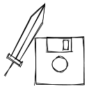

<h1 align="center">
   
  
   
  Excalistore
   
</h1>

<h4 align="center">A Chrome extension to store and manage multiple Excalidraw drawings</h4>
 

We all love excalidraw but wouldn't be great if you could store multiple drawing locally without leaving your browser?

With Excalistor, you can easily save and organize your Excalidraw drawings as you create them. The extension allows you to manage your drawings, and everything is stored locally on your browser so you don't have to worry about losing anything. Plus, it's completely free!

## Dev

This project uses Vite + yarn + React + TS.

Use `yarn build` to build the unpacked extension in `dist`.

To load the extension in Chrome navigate to [chrome://extensions](chrome://extensions/) and use the `Load unpacked` button to point to the `dist` folder.
