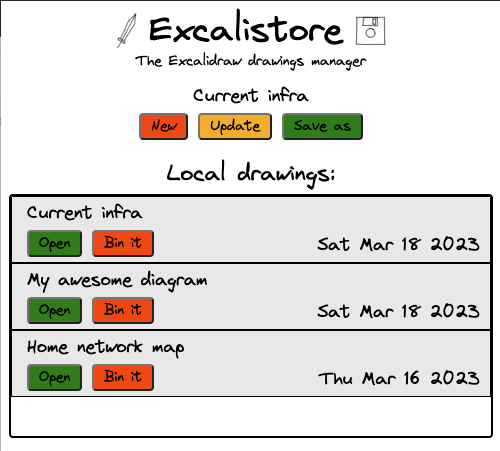

<h1 align="center">
  <br>
  
  <br>
  Excalistore
  <br>
</h1>

<h4 align="center">A browser extension to store and manage multiple Excalidraw drawings</h4>
<br/>
<p align="center">

<a href="https://github.com/andrewinci/excalistore/actions/workflows/ci.yml">
    
</a>
<a href="https://github.com/andrewinci/excalistore/releases/latest/" > 
    
</a>

</p>

<p align="center">
  <br>
  
</p>

We all love excalidraw but wouldn't be great if you could store multiple drawing locally without leaving your browser?

With Excalistore, you can easily save and organize your Excalidraw drawings as you create them and without leaving your browser.

## Browsers

- [Chrome web store ](https://chrome.google.com/webstore/detail/excalistore/cemnjkfjpieanmfoddiljfildcdipmgc)
- [Firefox add-on](https://addons.mozilla.org/en-GB/firefox/addon/excalistore/)

## Dev

To build the project locally you just need [volta](https://volta.sh/).

### Getting started

Install dependencies with:

```bash
yarn
```

Build the extension locally

```bash
yarn build
```

Bundle the extension

```bash
yarn bundle
```

To load the extension in Chrome navigate to [chrome://extensions](chrome://extensions/) and use the `Load unpacked` button to point to the `dist` folder.
Make sure to re-build after any change to test them in the browser.

### Publish to the browsers store

Trigger a release with `yarn release` then manually upload the `excalistore.zip` to the [Chrome web store](https://chrome.google.com/webstore/devconsole/) and [Firefox add-on hub](https://addons.mozilla.org/en-GB/developers/).

## Credits

- [Excalidraw](https://excalidraw.com/)
- [Excalidraw font: Virgil](https://virgil.excalidraw.com/)
