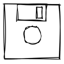

<h1 align="center">
  <br>
  
  <br>
  Excalistore
  <br>
</h1>

<h4 align="center">A Chrome extension to store and manage multiple Excalidraw drawings</h4>
<br/>
<p align="center">

<a href="https://github.com/andrewinci/excalistore/actions/workflows/ci.yml">
    
</a>
<a href="https://github.com/andrewinci/excalistore/releases/latest/" > 
    
</a>
<a href="https://chrome.google.com/webstore/detail/cemnjkfjpieanmfoddiljfildcdipmgc/" > 
    
</a>

</p>

<h1 align="center">
  <br>
  
</h1>

We all love excalidraw but wouldn't be great if you could store multiple drawing locally without leaving your browser?

With Excalistore, you can easily save and organize your Excalidraw drawings as you create them and without leaving your browser.

## Dev

To build the project locally you need: [yarn](https://yarnpkg.com/) and [volta](https://volta.sh/).

### Getting started

Install dependencies with:

```bash
yarn
```

Build the extension locally

```bash
yarn build
```

To load the extension in Chrome navigate to [chrome://extensions](chrome://extensions/) and use the `Load unpacked` button to point to the `dist` folder.
Make sure to re-build after any change to test them in the browser.

## Credits

- [Excalidraw](https://excalidraw.com/)
- [Excalidraw font: Virgil](https://virgil.excalidraw.com/)
